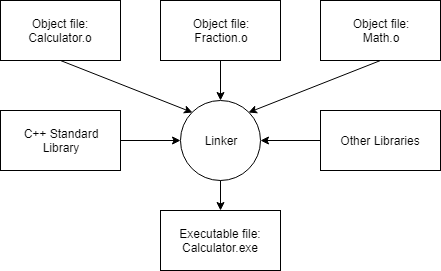

## best practices 
- name first/primary source code file in each program __main.cpp__ (easier to determine which source code file is primary one) 
  - normal to see first/primary source code file named after name of the program (ex. __calculator.cpp__, __poker.cpp)
  

## compiling source code 
- compiler goes through each source code file sequentially & does 2 important tasks: 
  1. checks code to make sure it follows rules of C++ lang 
  2. translates C++ code into machine lang ixns 
     a. stored in an intermediate file called an __object file__ 
     b. __.o__ files also contain other useful data which is needed by the linker 

### linking process 
- after compiler successfully finishes, linker kicks in 
- job: 
  - combine all object files & produce desired output file 
  - this process aka __linking__  
  - reads each of the .o files generated by the compiler & makes sure they're valid 
  - ensures all cross-file deps are resolved properly 
    - if we define something in one .cpp file, & then use in another .cpp file, linker connects two together 
  - typically links in one or more __library files__ which are collections of precompiled code that have been packaged up for reuse in other programs  
  - finally, linker outputs the desired output file 
    - typically, will be an executable file that can be launched (or a lib file) 
    
  